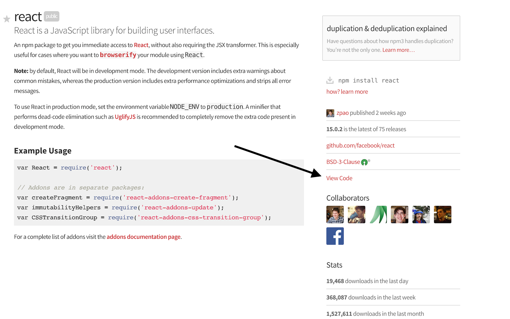

# npmcdn-link

Want to explore the actual code published for an npm package, without installing it locally? The [npmcdn](https://npmcdn.com/) service makes this a breeze.

This extension simply adds a link to packages on [npmjs.org](https://www.npmjs.org), with a quick link to view the code on [npmcdn](https://npmcdn.com/).

## Install
- [Chrome](https://chrome.google.com/webstore/detail/edafhclpiklopbghoeoefdajoadokdcb)

## Credits

- [npm team](https://github.com/npm)
- [Michael Jackson](https://github.com/mjackson)
